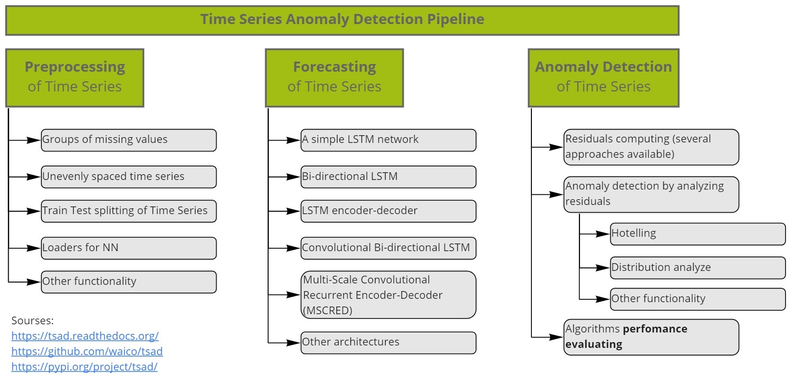
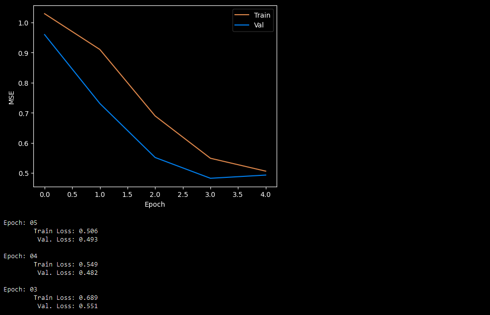

        [](https://www.gnu.org/licenses/gpl-3.0.html)  <!--  -->

[](README.md)

# Time Series Analysis for Simulation of Technological Processes - TSAD

## Содержание

  - [Содержание](#содержание)
  - [Введение](#введение)
  - [Документация](#документация)
  - [Приступая к работе](#приступая-к-работе)
    - [Системные требования](#системные-требования)
    - [Установка](#установка)
    - [Пример использования API](#пример-использования-api)
  - [Сравнение со похожими библиотеками](#сравнение-со-похожими-библиотеками)
  - [Рекомендации](#рекомендации)
  - [Цитирование TSAD](#цитирование-tsad)

## Введение

TSAD - это мощный модуль на Python, предназначенный для упрощения работы исследователей, использующих методы машинного обучения, специально разработанные для решения ключевых задач в промышленных областях.

Основная цель TSAD - предоставить исследователям эффективные инструменты для решения сложных проблем, связанных с:

- **Обнаружение неисправностей в промышленном оборудовании:**
  - Точно выявляйте и устраняйте неисправности в промышленном оборудовании, обеспечивая оптимальную производительность и надежность оборудования..

- **Совершенствование технологических процессов:**
  - Повысить общую производительность для повышения операционной эффективности.
  - Внедрить экономически эффективные меры по сокращению операционных расходов.
  - Усилить контроль качества и методы управления для достижения превосходных результатов.

### Решение проблемы обнаружения неисправностей

В TSAD проблема обнаружения неисправностей сводится к проблеме обнаружения аномалий временных рядов с использованием хорошо известной методики:

- Прогнозирование многомерного временного ряда (TS) на один пункт вперед (также работает для одномерных TS)
- Вычисление остатков между прогнозируемыми и истинными значениями
- Применяйте анализ остатков и, таким образом, находите аномалии



### Применение

1. **Прогностический и предписывающий анализ:**
   - Прогнозировать развитие ситуаций на основе анализа данных.
   - Автоматизировать принятие решений по диагностике и ремонту оборудования.

2. **Прогнозируемое техническое обслуживание оборудования:**
   - Использование методов математического моделирования, включая машинное обучение.
   - Снижение частоты поломок оборудования и связанных с ними повреждений.
   - Снижение затрат на диагностику и техническое обслуживание машин и промышленного оборудования.
   - Создание систем искусственного интеллекта для прогнозируемого технического обслуживания.

3. **Ультракороткосрочное прогнозирование:**
   - Анализ потоков данных в режиме реального времени.
   - Прогнозирование нештатных ситуаций.
   - Внедрение систем искусственного интеллекта для мониторинга в режиме реального времени.

4. **Обнаружение аномалий в производственных процессах:**
   - Выявление аномалий в производственных процессах.
   - Исследование первопричин аномалий.
   - Разработка систем искусственного интеллекта на основе алгоритмов математического моделирования, машинного обучения и исторических данных.

5. **Широкомасштабное прогнозирование временных рядов:**
   - Прогнозирование временных рядов в широком смысле, выходящее за рамки диагностики технических систем.

6. **Обнаружение аномалий в широком контексте:**
   - Обнаружение аномалий в различных контекстах, не ограничиваясь диагностикой технической системы.

7. **Обнаружение неисправности датчика:**
   - Обнаружение неисправных датчиков.

8. **Создание виртуальных датчиков:**
   - Разработка виртуальных датчиков.

9. **Прогнозирование качества продукции:**
   - Прогноз качества продукции.

Эти примеры прикладного использования демонстрируют универсальность TSAD в решении широкого спектра сценариев анализа промышленных данных. Будь то прогнозирование отказов оборудования, мониторинг потоков данных в режиме реального времени или прогнозирование качества продукции, TSAD предоставляет мощные решения для повышения эффективности принятия решений и оптимизации операционных процессов.

### Ключевые функции

Ознакомьтесь с мощными возможностями, предлагаемыми TSAD для всестороннего тестирования, оценки и точного анализа данных:

#### Возможности тестирования:

- Оцените TSAD с помощью вашего собственного набора данных.
- Протестируйте пользовательские алгоритмы обнаружения аномалий и прогнозирования.

#### Разведочный анализ данных:

- Анализ распределения, отсутствующих данных и закономерностей.

#### Эффективное решение проблем с данными:

- Выявляйте и решайте проблемы с данными с помощью оценочных метрик.

#### Применение машинного обучения:

- Используйте машинное обучение для задач обнаружения аномалий и прогнозирования.

#### Оценка производительности:

- Оценка качества алгоритмов обнаружения аномалий.

## Документация

[Документация](https://tsad.readthedocs.io/) охватывает широкий круг тем, включая:
- **Начало работы:**
  - Пошаговое руководство по установке TSAD и настройке вашей среды.
  - Примеры быстрого запуска, которые помогут вам начать работу с минимальными усилиями.

- **Обзор библиотеки:**
  - Подробные объяснения основных компонентов и концепций библиотеки TSAD.
  - Понимание структуры и дизайна архитектуры для эффективного использования.

- **Руководства по использованию и туториалы:**
  - Подробные руководства по использованию конкретных функций библиотеки.
  - Практические примеры и варианты использования для демонстрации реальных приложений.

- **Ссылка на API:**
  - Полная документация по TSAD API.
  - Подробные описания классов, методов и параметров для продвинутых пользователей.

## Приступая к работе

В этом разделе вы ознакомитесь с процессом начала работы с библиотекой TSAD.

### Системные требования

Убедитесь, что ваша система соответствует следующим спецификациям оборудования для обеспечения оптимальной производительности TSAD:

- **Минимальное количество процессоров (Intel):** 2
- **Минимальная частота процессора (ГГц):** 2,0
- **Минимальный объем оперативной памяти (ГБ):** 4,0
- **Минимальный объем видеопамяти (для внешнего видеоадаптера) (МБ):** 512
- **Тип конфигурации RAID и минимальное пространство на жестком диске (ГБ):** RAID 5; 500

Эти требования призваны обеспечить руководство по минимальным техническим характеристикам оборудования, которые должны быть доступны в системе, в которой развернут TSAD. Могут потребоваться корректировки в зависимости от размера и сложности обрабатываемых данных временных рядов.

Имейте в виду, что эти спецификации рекомендуются для обеспечения оптимальной производительности, и отклонения могут повлиять на эффективность работы библиотеки.

### Установка

Установите последнюю стабильную версию `tsad`, используя `pip` для `Python 3.10`:

```bash
pip install -U tsad
```

В качестве альтернативы вы можете установить последнюю версию для разработки непосредственно из репозитория GitHub:

```bash
pip install git+https://github.com/waico/tsad.git
```

### Пример использования API

Чтобы быстро увидеть TSAD в действии, начните с использования простого примера в вашем скрипте на Python. Ниже приведен базовый пример:

```python
# Импорт необходимых модулей
import sys
sys.path.insert(1, '../')
from tsad.base.pipeline import Pipeline
from tsad.base.datasets import load_skab
from tsad.pipelines import ResidualAnomalyDetectionTaskSet

# Загрузка данных
dataset = load_skab()
targets = dataset.target_names 
data = dataset.frame.drop(columns=targets).droplevel(level=0)

# Создайте конвейер и обучите/спрогнозируйте
pipeline = Pipeline(ResidualAnomalyDetectionTaskSet)
pred = pipeline.fit_predict(data,n_epochs=5)
```

После этого вы сможете увидеть:




Посетите [Руководство](https://github.com/waico/tsad/tree/main/Tutorials) в репозитории TSAD на GitHub, чтобы ознакомиться с практическими примерами и идеями.

## Дорожная карта и будущие разработки

Мы приветствуем активное участие сообщества и ценим ваши отзывы о желаемых функциях TSAD. Наши текущие планы развития включают:

1. **Усовершенствованная предварительная обработка временных рядов:**
   - Изучение более сложных методов предварительной обработки, в частности решение проблем, связанных с сокращением временных рядов до одной частоты дискретизации, особенно в случаях неравномерно распределенных временных рядов.

2. **Внедрение самых современных алгоритмов (SOTA):**
   - Постоянные усилия по интеграции дополнительных самых современных алгоритмов в TSAD, гарантирующие, что библиотека остается актуально в анализе временных рядов.

3. **Гибкая реализация модели:**
   - Предоставление функции, которая позволяет пользователям легко внедрять и интегрировать свои модели в наш конвейер, предоставляя прямую ссылку на их репозитории на GitHub. Эта функция направлена на облегчение сотрудничества между исследователями, которые часто стремятся проверить и сравнить свои модели с другими.

4. **Интеграция с эталонными показателями:**
   - Работа над интеграцией TSAD с различными эталонными показателями прогнозирования и обнаружения аномалий. Эта интеграция позволит пользователям оценивать эффективность TSAD в соответствии с установленными стандартами, повышая прозрачность и надежность анализа временных рядов.

Ваш вклад и сотрудничество имеют важное значение для формирования будущего развития TSAD. Мы рекомендуем вам делиться своими мыслями, предложениями и вкладами в повышение функциональности и универсальности библиотеки. Вместе мы сможем продолжать продвигать анализ временных рядов в сообществе TSAD.


## Сравнение со похожими библиотеками

Сравнение TSAD с другими библиотеками в различных аспектах:

|  | [Merlion](https://github.com/salesforce/Merlion) | [Alibi Detect](https://github.com/SeldonIO/alibi-detect) | [Kats](https://github.com/facebookresearch/Kats) | [pyod](https://github.com/yzhao062/pyod) | [GluonTS](https://github.com/awslabs/gluon-ts) | RRCF | STUMPY | Greykite | [Prophet](https://github.com/facebook/prophet) | [pmdarima](https://pypi.org/project/pmdarima/) | [deepad](https://github.com/fastforwardlabs/deepad) | TSAD
:--- | :---: | :---:|  :---:  | :---: | :---: | :---: | :---: | :---: | :----: | :---: | :---: | :---:
| Прогнозирование | ✅ | | ✅ |  | ✅ | | | ✅ | ✅ | ✅ | ✅ | ✅ 
| Поиск аномалий | ✅ | ✅ | ✅ | ✅ | | ✅ | ✅ | ✅ | ✅ | | ✅ | ✅ 
| Алгоритмы оценки | ✅ | | | ✅ | ✅ | | | | | | ✅ | ✅
| Ансамбли | ✅ | | | ✅ | | ✅  | | | | | | ✅ 
| Бенчмарки и датасеты | ✅ | | | ✅ | ✅ | | | | | | | ✅ 
| Визуализация результатов | ✅ | | ✅ | ✅ | | | | ✅ | ✅ | | | ✅ | ✅ 
| Предварительная обработка данных | | | ✅ | | | | | | | | | ✅ 
| Автоматизированный разведочный анализ данных | | | | | | | | | | | | ✅ 


<!-- #### Dependencies

* TODO

#### Repo structure

```
  └── repo 
    ├───docs       # documentation
    ├───tutorials   # examples
    ├───tsad       # files of library
``` -->

## Рекомендации

Дополнительне материалы и библиотеки для изучения:

1.  https://github.com/salesforce/Merlion 
2.  https://github.com/fastforwardlabs/deepad
3.  https://github.com/HendrikStrobelt/LSTMVis 
4.  https://github.com/TezRomacH/python-package-template 
5.  https://github.com/khundman/telemanom 
6.  https://github.com/signals-dev/Orion 
7.  https://github.com/NetManAIOps/OmniAnomaly 
8.  https://github.com/unit8co/darts
9.  https://github.com/tinkoff-ai/etna-ts
9.  https://github.com/yzhao062/pyod
10.  https://www.radiativetransfer.org/misc/typhon/doc/modules.html#datasets
10.  https://github.com/AutoViML/Auto_TS
10.  https://nuancesprog.ru/p/15161/
10.  https://www.sktime.org/en/stable/
10.  https://github.com/zalandoresearch/pytorch-ts
10.  https://github.com/qdata/spacetimeformer
10.  https://joaquinamatrodrigo.github.io/skforecast/0.6.0/index.html

<!-- Про архитектуру: 

https://pypi.org/project/catalyst/  -->

## Цитирование TSAD

Если вы используете TSAD в своих исследованиях или приложениях, пожалуйста, укажите, используя этот BibTeX:

```
@misc{TSAD2013,
  author = {Viacheslav Kozitsin and Oleg Berezin and Iurii Katser and Ivan Maksimov},
  title = {Time Series Analysis for Simulation of Technological Processes - TSAD},
  year = {2023},
  publisher = {GitHub},
  journal = {GitHub repository},
  howpublished = {\url{https://github.com/waico/tsad}},
}
```